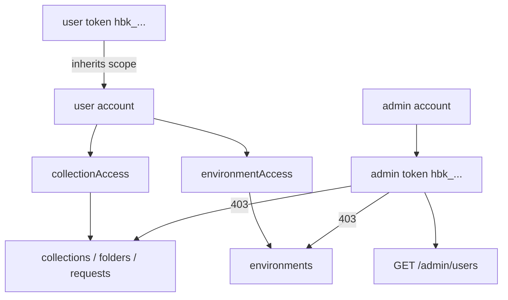

# Authentication

Team Hub protects API routes with database-backed bearer tokens tied to user accounts. HarborClient desktop clients authenticate with `user`-role tokens for shared data; operators authenticate with `admin`-role tokens for account management via the REST API. The CLI remains available for user and token administration.

## Prerequisites

Configure your database in `server.yaml`, then apply schema migrations:

```bash
team-hub migrate
```

For Postgres and MySQL this creates the `users` and `api_tokens` tables (plus entity tables). Firestore uses schemaless `users` and `apiTokens` collections.

Migration also assigns any legacy tokens without an owner to a bootstrap user named `bootstrap` with full (`*`) collection and environment access. Create named users, issue new tokens, then revoke bootstrap tokens when you are ready.

## Roles and access

Every account has a role of either `user` or `admin`. Set the role when creating or updating a user via the CLI (see [Manage users](#manage-users)).

### Roles

| Role | Purpose | Entity HTTP API | Management HTTP API | API tokens |
| ---- | ------- | --------------- | ------------------- | ---------- |
| `user` | HarborClient desktop clients | Scoped — [API Endpoints](./endpoints.md) | No (403) | Yes |
| `admin` | Operators and automation | List on `GET /collections` and `GET /environments`; delete and configure deletion lock via `/admin/*` | List/update/delete users; configure collections and environments via `/admin/*` | Yes |

**`admin` accounts**

- Can receive bearer tokens for REST authentication.
- May call `GET /collections` and `GET /environments` (returns the full catalog; no content mutations).
- Cannot read or mutate individual collection/environment content, folders, or requests (403 on other entity routes).
- Can delete collections and environments via `DELETE /admin/collections/:id` and `DELETE /admin/environments/:id`, and toggle a per-entity `deletionLocked` flag via `PUT /admin/collections/:id` and `PUT /admin/environments/:id`.
- Do not use access lists (always stored empty); passing `--collection-access` or `--environment-access` on create or update is rejected.
- Can list, update, and delete user accounts via `GET`, `PUT`, and `DELETE /admin/users`. Deleting a user permanently removes their API tokens.
- Can list collection, environment, and hub LLM model metadata via `GET /admin/collections`, `GET /admin/environments`, and `GET /admin/llm/models` when assigning user access lists. List entries include `deletionLocked`.

**`user` accounts**

- Intended for HarborClient desktop clients authenticating with `hbk_…` bearer tokens.
- Permissions come from access lists described in [Access](#access) below.
- Cannot call management endpoints (403 when those routes exist).

### Access

Access lists scope what a `user`-role account can see and change on entity routes. Both fields are independent JSON arrays of UUID strings on the user record. Only `user`-role accounts use these fields; `admin` accounts always have `[]` and cannot mutate entity routes or read nested collection data.

**Wildcard `*`**

- `['*']` grants all resources of that type.
- The wildcard must be the only entry — the CLI rejects lists like `['*', '<uuid>']`.
- Set via `--collection-access '*'` or `--environment-access '*'`.

**What each list controls**

| Field | Governs |
| ----- | ------- |
| `collectionAccess` | Collections, and all folders and requests inside allowed collections |
| `environmentAccess` | Environments only |

**Permission matrix for `user` accounts**

| Access config | List (GET) | Create top-level resource (POST `/collections` or `/environments`) | CRUD inside allowed scope |
| ------------- | ---------- | ------------------------------------------------------------------ | ------------------------- |
| `['*']` | All | Yes | Yes |
| Specific UUIDs | Only listed ids | No (403) | Yes for listed collections/environments |
| `[]` | Empty (200, `[]`) | No | 403 on any entity operation |

Scoped users can create folders and requests **within** collections they can access. Only **new top-level** collections or environments require wildcard access on the relevant list.

**Token inheritance**

API tokens do not carry their own scope. Each token inherits the owning user's `collectionAccess` and `environmentAccess` entirely.

**HTTP outcomes**

- Invalid or missing token → **401** (see [API Endpoints — Errors](./endpoints.md#errors)).
- Valid token but wrong role or out-of-scope resource → **403** `{ "error": "Forbidden" }`.
- Too many failed auth attempts for the same client IP and token → **429** `{ "error": "Too Many Requests" }` with a `Retry-After` header.
- Throttle store unavailable → **503** `{ "error": "Service Unavailable" }`.

## Session introspection

Clients such as HarborClient can call **`GET /auth/session`** with a bearer token to learn which user account owns the token and which API surfaces it may use. The response includes:

| Field | Description |
| ----- | ----------- |
| `user.id` | Stable user account identifier |
| `user.name` | Display name |
| `user.role` | `user` or `admin` |
| `token.id` | API token record identifier |
| `token.prefix` | Non-secret token prefix (for example `hbk_AbCd1234`) |
| `capabilities.dataApi` | Entity routes (collections, environments, folders, requests) |
| `capabilities.managementApi` | Management routes (for example `GET /admin/users`) |
| `capabilities.llm` | Hub-proxied LLM routes when enabled for the account |

Example for a `user`-role token:

```json
{
  "user": { "id": "550e8400-e29b-41d4-a716-446655440000", "name": "alice", "role": "user" },
  "token": { "id": "660e8400-e29b-41d4-a716-446655440001", "prefix": "hbk_AbCd1234" },
  "capabilities": { "dataApi": true, "managementApi": false, "llm": true }
}
```

For an `admin`-role token, `dataApi` is `false` and `managementApi` is `true`. HarborClient can use this endpoint when saving a team hub connection to decide whether to show operator administration UI.

See [API Endpoints — GET /auth/session](./endpoints.md#get-authsession) for the full route reference.

## Throttling

Failed authentication attempts are counted in Redis and throttled per **client IP + token**. Raw bearer secrets are never stored in Redis; the server hashes the token and uses `{ip}:{sha256(token)}` as the throttle key. Requests with no bearer token use `{ip}:none`.

**Default policy**

| Setting | Default | Meaning |
| ------- | ------- | ------- |
| `maxFailures` | 10 | Failed attempts allowed within the window |
| `windowSeconds` | 900 (15 min) | Failure counter window |
| `blockSeconds` | 900 (15 min) | Block duration after threshold is reached |

When the block is active, protected routes return **429** with `Retry-After` set to the configured block duration. A successful authentication clears the failure counter and block for that key.

**Configuration**

Redis is required. Add a `redis` section to `server.yaml` and run Redis alongside the server (for local development, `docker compose up` starts Postgres and Redis):

```yaml
redis:
  host: 127.0.0.1
  port: 6380
  # password: optional
  # keyPrefix: optional namespace for keys
  # maxFailures: 10
  # windowSeconds: 900
  # blockSeconds: 900
```

If Redis is unreachable while handling a protected request, authentication fails closed with **503** rather than allowing requests through without throttling.



## Manage users

Use the command line to create and manage users. See [CLI](./cli.md#user) for the full command reference, options, and output formats.

```bash
# Create an operator account (admin role, for management API tokens)
team-hub user create --name ops --role admin

# Create a user with full access
team-hub user create --name alice --role user \
  --collection-access '*' --environment-access '*'

# Create a user with access to specific collections/environments
team-hub user create --name bob --role user \
  --collection-access <collection-id> --environment-access <environment-id>

# Grant hub-proxied LLM access (see docs/llm.md)
team-hub user create --name carol --role user \
  --collection-access '*' --environment-access '*' \
  --llm-access --llm-model '*' --llm-monthly-tokens 100000

team-hub user list
team-hub user show <user-id>
team-hub user update <user-id> --role user --collection-access '*'
team-hub user delete <user-id>
```

## Manage tokens

Tokens always belong to a user. Issue `user`-role tokens for HarborClient desktop clients and `admin`-role tokens for operator REST clients. Entity routes require a `user`-role token; management routes will require an `admin`-role token. See [CLI — user token](./cli.md#user-token) for all token subcommands and flags.

```bash
team-hub user token create --user <user-id> --name "Alice laptop"
team-hub user token list
team-hub user token list --user <user-id>
team-hub user token revoke <token-id>
```

The `user token create` command prints a one-time secret prefixed with `hbk_`. Store it immediately — the server only persists a sha256 hash.

Example output:

```text
Created API token "Alice laptop" (550e8400-e29b-41d4-a716-446655440000) for user "alice".
Token prefix: hbk_AbCd1234

Store this token now; it will not be shown again:
hbk_...
```
